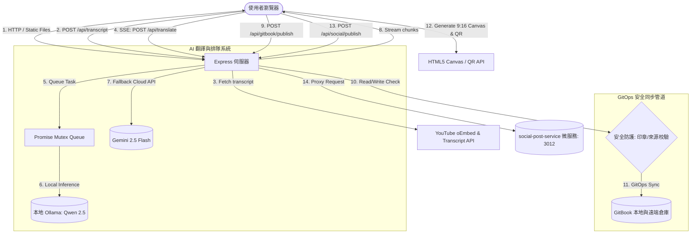

# 🎙️ YouTube Podcast Translator 面試深度解析指南 (Interview Guide)

本指南旨在為技術面試提供本專案的核心工程設計決策、架構亮點以及技術折衷（Trade-offs）分析，幫助面試官快速識別本專案的系統深度。

---

## 🗺️ 系統架構圖 (System Architecture)

---

## 💎 核心工程亮點與技術折衷 (Core Engineering Highlights & Trade-offs)

### 1. 串流傳輸：Server-Sent Events (SSE) vs 傳統 REST API
在 AI 翻譯長影片字幕時，由於 LLM 推理需要數十秒甚至數分鐘，傳統的 HTTP POST 請求會面臨嚴重的 **Gateway Timeout (504)** 逾時問題，且使用者介面會長時間處於卡死狀態，造成極差的體驗。

*   **我們的設計**：採用 **SSE (Server-Sent Events)** 串流傳輸技術。
    *   **優勢**：
        1.  **秒級首字響應 (Low TTFB)**：字幕按段分批翻譯，一完成即時推送到前端，介面隨時更新進度條與部分翻譯內容。
        2.  **連線生命週期管理**：伺服器監聽 `req.on('close')`。一旦使用者關閉分頁或取消，伺服器立即中斷後續的 LLM 請求，**防範無效的 Token/運算資源浪費**。
        3.  **輕量級單向通道**：相較於雙向的 WebSocket，SSE 基於純 HTTP 協議，無須額外的協議升級與複雜握手，更適合這種單向資料推送場景。
*   **技術折衷**：SSE 在 HTTP/1.1 下有瀏覽器最大連線數限制 (通常為 6 個)，但本專案預期為單人工具，且在 HTTP/2 下此限制已被消除。

---

### 2. 系統資源控制：本地大腦 Ollama 互斥排隊鎖 (Mutex Queue) 與超時控制
在消費者級硬體（如 Mac Mini 或一般筆電）上運行本地大型語言模型 (如 Qwen 2.5 14B) 時，GPU 記憶體與 CPU 執行緒是非常稀缺的資源。若前端發生併發請求，多個 LLM 推理任務同時執行，將會導致**系統記憶體耗盡 (OOM)、高延遲與伺服器崩潰**。

*   **我們的設計**：
    1.  **Promise 鏈排隊鎖**：在 `src/services/ai.service.js` 中實作了一個基於 Promise 鏈的極簡互斥排隊鎖 (`enqueueOllamaTask`)，確保本地模型串行執行。
    2.  **超時斷開保護 (AbortSignal.timeout)**：為防止 Ollama 伺服器掛起（Hang）或過載導致排隊鎖永久死鎖（Queue Starvation），所有 Ollama 的 `fetch` 請求皆加上了 `AbortSignal.timeout` 保護（翻譯 60 秒，Slug 15 秒），一旦超時即自動釋放鎖定。
*   **技術折衷**：排隊會增加多使用者併發時的等待時間。但本專案定位為個人生產力工具，**系統穩定性與資源保護的優先級高於極端高併發吞吐量**。

---

### 3. GitOps 安全發佈管道與完整性防護
當自動化工具向 GitBook 知識庫推送內容時，最核心的挑戰是：**如何確保外人或自動化腳本不會無意或惡意地覆蓋掉使用者手寫的寶貴筆記？**

*   **我們的安全防護策略**：
    1.  **自動生成印章 (Signature Marker)**：自動產生的 Markdown 檔案首行都會印上特定的印章 `<!-- gitbook-plugin-youtube-podcast-translator-auto-generated -->`。
    2.  **嚴格防覆蓋校驗**：當寫入目標路徑已存在檔案時：
        *   若該檔案**無印章**，判定為手寫稿，**絕對禁止寫入 (返回 409 Conflict)**。
        *   若該檔案**有印章**，但請求**非來自本地端點 (`isLocalRequest` 判定為偽)**，**拒絕覆蓋**，防止外部使用者洗掉內容。
    3.  **防路徑穿越 (Path Traversal Protection)**：使用 `path.relative` 強制校驗寫入目標必須完全限制在 `podcast-translations/` 目錄內，杜絕安全漏洞。
    4.  **強固 GitOps 同步流程與 Mutex 佇列**：在寫入前執行 `git fetch` 加上 `git reset --hard` 同步。為了防止併發發佈造成 `SUMMARY.md` 損壞與 `.git/index.lock` 被鎖定，我們為 GitOps 發佈流程同樣實作了互斥排隊鎖（`enqueueGitOpsTask`），保證 GitOps 操作的原子性與完整性。

---

### 4. 社交分享：IG Story 限動卡片生成器與微服務整合
為了讓使用者能快速將成果發佈至 Instagram 限時動態，且具備直達連結與高質感排版，我們面臨了 **Meta 官方 API 不開放限動發佈與連結貼圖** 的硬性限制。

*   **我們的設計（折衷產品設計）**：
    1.  **零依賴 HTML5 Canvas 圖片生成技術**：
        *   為了避免引入臃腫的 `html2canvas` 或 `puppeteer` 導致前端包體膨脹，我們在 React 中使用純 JavaScript 透過 HTML5 Canvas API 手寫了高效的卡片渲染引擎。
        *   引擎在背景渲染一張符合 IG 限動比例（9:16，1080x1920）的高解析度 PNG 圖片，包含 Podcast 中英文標題、圓角卡片磨砂效果（Glassmorphism）、影片封面指示圖與**動態 QR Code 二維碼**。
    2.  **跨域安全防範 (Tainted Canvas Guard)**：
        *   在 Canvas 繪製動態 QR Code 時，若直接繪製外部圖片會觸發瀏覽器的「畫布污染 (Tainted Canvas)」安全限制，導致無法導出 base64 圖片。
        *   我們在載入 Image 時顯式設定 `qrImage.crossOrigin = 'anonymous'` 繞過此安全限制，成功導出 PNG。
    3.  **微服務整合與明確錯誤語意 (Microservice Proxy with Honest Semantics)**：
        *   後端 Express 新增了 `POST /api/social/publish` 路由，作為 companion microservice `social-post-service` (port: 3012) 的發佈代理。
        *   設定 5 秒超時（`AbortSignal.timeout(5000)`）防止微服務當機掛起主伺服器。若連線失敗，Live 與 Demo 都會明確失敗，不再由主服務偽造任務成功。
        *   Demo 模式不是主服務本地假任務，而是代理到 `social-post-service` 並傳入 `mode: "mock"`，由微服務建立 job、轉移狀態、提供輪詢結果。

#### 🔧 原本 code 與現在 code 的差別

**原本的做法：**
* `youtube-podcast-translator` 的 `server.js` 內有一個 `mockJobs` 記憶體 `Map`。
* 前端選 Demo Mock 時，主服務自己產生 `mock-*` jobId，自己用時間差模擬 `queued -> posting -> completed`。
* `/api/social/status/:jobId` 如果看到 `mock-*`，就直接查主服務自己的 `mockJobs`，完全不需要 `social-post-service` 存在。
* Live 模式有代理到 `social-post-service`，但 Demo 模式其實沒有跨服務邊界，因此嚴格說只是主服務裡的模擬流程。

**現在的做法：**
* `youtube-podcast-translator` 不再保存任何 mock job 狀態。
* Demo Mock 也會呼叫 `social-post-service` 的 `POST /api/posts`，並送出 `mode: "mock"`。
* `social-post-service` 是 job lifecycle 的唯一 owner：建立 job、儲存狀態、執行 `MockStrategy`、回傳 `GET /api/posts/:id` 查詢結果。
* Live 模式會送 `mode: "live"`；如果下游仍是 `STRATEGY=mock`，微服務回 `503`，避免把 demo mock 包裝成真實 Instagram 發佈。
* translator 只負責組 caption、轉交請求、處理 timeout、代理 status polling，符合 gateway/proxy 的責任邊界。

#### 🎤 面試攻防實戰（Mock Interview Q&A）

> **面試官問**：「既然 Meta API 根本不允許第三方直接發文至 IG Story，為什麼你還要設計一個發佈微服務，而不是直接讓前端下載圖片就好？」
>
> **您的回答應對（產品折衷與架構前瞻）**：
> 1. **產品與 UX 面向的折衷設計**：
>    「這是一個典型的 API 邊界限制下的 UX 折衷。我們無法直接幫用戶發 Story，但我們可以做到『半自動化橋接』：前端繪製高質感的 9:16 分享圖，並在使用者點擊發佈時，**自動將 GitBook 目標連結複製到用戶剪貼簿**。用戶下載圖片後，直接在 IG 上傳並貼上連結即可，將摩擦力降到最低。」
> 2. **架構上的高內聚、低耦合**：
>    「在系統面上，我依然將『社交分享』解耦為獨立的微服務 `social-post-service`，並使用 `202 Accepted` 的非同步任務隊列設計。這樣做有兩個重大的工程優點：
>    * **高彈性 (Flexibility)**：微服務內部採用**策略模式 (Strategy Pattern)**。目前雖然因為 Meta 的限制使用 `MockStrategy` 來記錄發佈日誌與狀態機轉移；但如果未來 Meta 開放了限動 API，或者我們想擴展發佈到其他有開放 API 的社交平台（如 Threads 或 X/Twitter），**主翻譯服務不需要理解每個平台 SDK**，只需維持同一個 `POST /api/posts` contract。
>    * **高可觀測性 (Observability)**：主服務不再把下游失敗包裝成成功。Live 發佈如果沒有真實 provider strategy，就回 `503`；Demo 發佈則明確標示 `mode: "mock"`。這讓產品展示方便，但工程語意仍然誠實。」

#### ⚖️ 做成 microservice 的優點與缺點

**優點：**
* **責任分離**：translator 專心處理字幕、翻譯、GitBook 發佈與前端 UX；social-post-service 專心處理社群發佈任務。
* **可替換平台策略**：未來要接 Threads、X、Ayrshare 或真實 Meta provider，只改 `social-post-service` 的 strategy，不必把平台 SDK 塞進 translator。
* **非同步工作更自然**：社群發佈通常有圖片上傳、限流、失敗重試、平台回傳 ID 等延遲工作，用 `202 Accepted + jobId + polling` 比同步等待更合理。
* **錯誤更清楚**：下游掛掉、下游拒絕、真實 provider 不存在，現在可以用不同 HTTP status 和 job status 表達，而不是全部假裝成功。
* **面試敘事更站得住腳**：現在 Demo mock job 也真的跨服務，不是同一個 Express app 內部演戲。

**缺點：**
* **本地開發更麻煩**：要同時啟動 translator 與 social-post-service，少開一個服務就會 503。
* **部署與監控成本增加**：多一個 process，就多健康檢查、PM2 設定、log、port、環境變數與 restart 流程。
* **分散式除錯更難**：以前只看 translator log；現在要追 `3015 -> 3012` 兩邊的 request 和 jobId。
* **資料一致性還是有限**：目前 social-post-service 用 in-memory job store，重啟後 job 狀態會消失；若要正式產品化，需要 Redis/BullMQ 或資料庫。
* **對這個規模可能偏重**：如果只是個人一次性下載 IG 圖卡，前端 Native Share + 下載就夠；microservice 是為了展示可擴展邊界與未來平台整合，不是最低成本做法。

---

### 5. SOLID Clean Architecture 模組化重構
原先專案的 `server.js` 是一個典型的 Monolith (巨石型) 腳本，包含了路由、身份校驗、AI 連線、GitOps 邏輯以及工具函式，導致代碼難以維護且**無法進行有效的單元測試**。

*   **重構後的架構**：
    *   `src/utils/helpers.js`：無副作用的純函數 (Pure Functions)，負責 Slug 清理、ID 提取等，實現 **100% 單元測試覆蓋率**。
    *   `src/middleware/auth.js`：負責存取安全校驗與 Rate Limiting（並採用可選鏈安全讀取 `req.socket` 避免舊版 Node.js `req.connection` 棄用崩潰）。
    *   `src/services/ai.service.js`：封裝 Ollama 與 Gemini 連線，管理 Mutex 任務隊列。
    *   `src/services/gitbook.service.js`：隔離所有與 GitOps 相關的檔案 I/O 與 Shell 命令執行。
    *   `server.js` : 僅作為 Express 路由宣告與啟動入口，保持代碼簡潔明瞭。

---

## 🧠 什麼是系統可觀測性？(System Observability - ELI5 小朋友解釋法)

在現代的分散式系統與微服務架構中，**可觀測性（Observability）** 是一個非常高頻出現的核心概念。以下是用最簡單的「小朋友解釋法」來理解它：

> **🧸 小朋友解釋法 (ELI5)**
> 
> 想像你有一台用積木和齒輪做成的「自動糖果販賣機」，你把它裝在一個紙箱裡。
> 
> * **沒有可觀測性（黑盒子）**：
>   如果有一天機器壞了，按按鈕沒有糖果掉出來。因為紙箱是封閉的，你完全不知道裡面發生了什麼事。你只能猜：「是齒輪卡住了？還是糖果發完了？還是發條斷了？」此時你只能把整台機器砸開才能找原因。
> * **具備可觀測性（透明玻璃與儀表板）**：
>   現在，我們把紙箱換成「透明的玻璃箱」，並且在齒輪上貼上小貼紙，裝上小指針與小喇叭。
>   當齒輪卡住時，指針會立刻指向「齒輪 B」；糖果發完時，小喇叭會嗶嗶叫說「草莓糖果空了」。你不用砸開機器，從外面看一眼，就知道**是誰壞了、為什麼壞了**。
>
> 在寫程式時，**可觀測性**就是這個「透明玻璃與指針」。我們透過**日誌（Logs）、指標（Metrics）和追蹤 ID（Tracing）**，讓工程師不用通靈，看一眼日誌就知道系統內部到底發生了什麼事。

---

### 🛠️ 專案中的真實應用案例（面試高光點）

我們在微服務 `social-post-service` 的報錯處理中，完美落實了可觀測性：

* **錯誤的設計（隱藏細節）**：
  如果微服務明明啟動了，但因為我們傳過去的圖片太大而回傳了 `500 錯誤`；此時如果後端把這個錯誤吃掉，假裝它「連線失敗」並自動降級顯示「模擬發佈成功」，這就是**摧毀了可觀測性**。管理者會以為發佈成功，但實際上資料根本沒進去，而且沒有人知道為什麼。
* **正確的設計（維持可觀測性）**：
  我們修改了程式碼，嚴格區分：
  1. **連線失敗/超時 (Live 模式)**：這是實體連線與部署問題。我們拒絕包裝，而是明確回傳 `503 Service Unavailable` 錯誤並進行日誌記錄，讓前端使用者能立即得知微服務狀態，維持高可觀測性。
  2. **Demo 模擬展示模式**：當手動啟用模擬模式時，主服務仍會代理到 `social-post-service`，由下游服務以 `MockStrategy` 建立並處理一整套從 `queued` 到 `completed` 的非同步任務狀態移轉。
  3. **微服務 API 報錯 (如 400/500)**：我們原封不動地將下游微服務的狀態碼與錯誤訊息回傳給前端，絕不遮掩真實異常。
