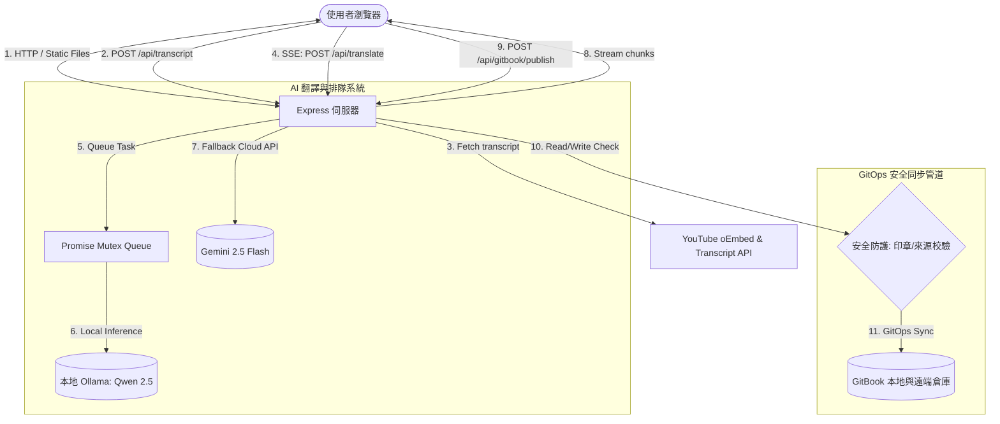

# 🎙️ YouTube Podcast Translator 面試深度解析指南 (Interview Guide)

本指南旨在為技術面試提供本專案的核心工程設計決策、架構亮點以及技術折衷（Trade-offs）分析，幫助面試官快速識別本專案的系統深度。

---

## 🗺️ 系統架構圖 (System Architecture)



---

## 💎 核心工程亮點與技術折衷 (Core Engineering Highlights & Trade-offs)

### 1. 串流傳輸：Server-Sent Events (SSE) vs 傳統 REST API
在 AI 翻譯長影片字幕時，由於 LLM 推理需要數十秒甚至數分鐘，傳統的 HTTP POST 請求會面臨嚴重的 **Gateway Timeout (504)** 逾時問題，且使用者介面會長時間處於卡死狀態，造成極差的體驗。

*   **我們的設計**：採用 **SSE (Server-Sent Events)** 串流傳輸技術。
    *   **優勢**：
        1.  **秒級首字響應 (Low TTFB)**：字幕按段分批翻譯，一完成即時推送到前端，介面隨時更新進度條與部分翻譯內容。
        2.  **連線生命週期管理**：伺服器監聽 `req.on('close')`。一旦使用者關閉分頁或取消，伺服器立即中斷後續的 LLM 請求，**防範無效的 Token/運算資源浪費**。
        3.  **輕量級單向通道**：相較於雙向的 WebSocket，SSE 基於純 HTTP 協議，無須額外的協議升級與複雜握手，更適合這種單向資料推送場景。
*   **技術折衷**：SSE 在 HTTP/1.1 下有瀏覽器最大連線數限制 (通常為 6 個)，但本專案預期為單人工具，且在 HTTP/2 下此限制已被消除。

---

### 2. 系統資源控制：本地大腦 Ollama 互斥排隊鎖 (Mutex Queue)
在消費者級硬體（如 Mac Mini 或一般筆電）上運行本地大型語言模型 (如 Qwen 2.5 14B) 時，GPU 記憶體與 CPU 執行緒是非常稀缺的資源。若前端發生併發請求，多個 LLM 推理任務同時執行，將會導致**系統記憶體耗盡 (OOM)、高延遲與伺服器崩潰**。

*   **我們的設計**：在 `src/services/ai.service.js` 中實作了一個基於 **Promise 鏈 (Promise Chain)** 的極簡互斥排隊鎖。
    ```javascript
    let ollamaQueuePromise = Promise.resolve();
    export async function enqueueOllamaTask(taskFn) {
      const nextTask = ollamaQueuePromise.then(() => taskFn());
      ollamaQueuePromise = nextTask.catch(() => {}); // 確保即使失敗也能繼續執行下一個
      return nextTask;
    }
    ```
    *   **優勢**：
        1.  **序列化密集運算**：強迫所有本地 LLM 任務依序執行，確保系統負載平穩。
        2.  **容錯與連續性**：使用 `.catch(() => {})` 捕獲個別任務的異常，確保排隊鏈不會因為某個任務出錯而中斷死鎖。
*   **技術折衷**：排隊會增加多使用者併發時的等待時間。但本專案定位為個人生產力工具，**系統穩定性與資源保護的優先級高於極端高併發吞吐量**。

---

### 3. GitOps 安全發佈管道與完整性防護
當自動化工具向 GitBook 知識庫推送內容時，最核心的挑戰是：**如何確保外人或自動化腳本不會無意或惡意地覆蓋掉使用者手寫的寶貴筆記？**

*   **我們的安全防護策略**：
    1.  **自動生成印章 (Signature Marker)**：自動產生的 Markdown 檔案首行都會印上特定的印章 `<!-- gitbook-plugin-youtube-podcast-translator-auto-generated -->`。
    2.  **嚴格防覆蓋校驗**：當寫入目標路徑已存在檔案時：
        *   若該檔案**無印章**，判定為手寫稿，**絕對禁止寫入 (返回 409 Conflict)**。
        *   若該檔案**有印章**，但請求**非來自本地端點 (`isLocalRequest` 判定為偽)**，**拒絕覆蓋**，防止外部使用者洗掉內容。
    3.  **防路徑穿越 (Path Traversal Protection)**：使用 `path.relative` 強制校驗寫入目標必須完全限制在 `podcast-translations/` 目錄內，杜絕安全漏洞。
    4.  **強固 GitOps 同步流程**：在寫入前執行 `git fetch` 加上 `git reset --hard origin/main`，確保工作區與遠端代碼倉庫完全一致，徹底避免 Git Push 因非快進（Non-Fast-Forward）而引發的衝突。

---

### 4. SOLID Clean Architecture 模組化重構
原先專案的 `server.js` 是一個典型的 Monolith (巨石型) 腳本，包含了路由、身份校驗、AI 連線、GitOps 邏輯以及工具函式，導致代碼難以維護且**無法進行有效的單元測試**。

*   **重構後的架構**：
    *   `src/utils/helpers.js`：無副作用的純函數 (Pure Functions)，負責 Slug 清理、ID 提取等，實現 **100% 單元測試覆蓋率**。
    *   `src/middleware/auth.js`：負責存取安全校驗與 Rate Limiting。
    *   `src/services/ai.service.js`：封裝 Ollama 與 Gemini 連線，管理 Mutex 任務隊列。
    *   `src/services/gitbook.service.js`：隔離所有與 GitOps 相關的檔案 I/O 與 Shell 命令執行。
    *   `server.js` : 僅作為 Express 路由宣告與啟動入口，保持代碼簡潔明瞭。
